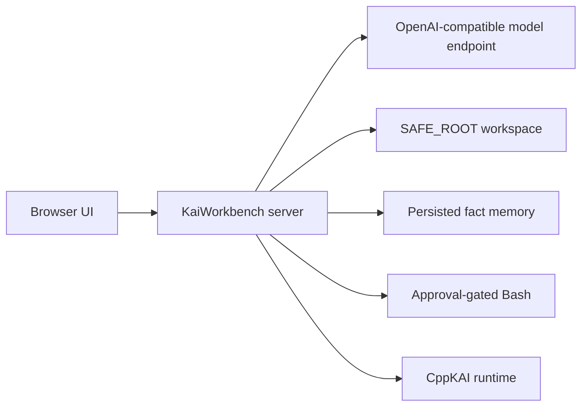
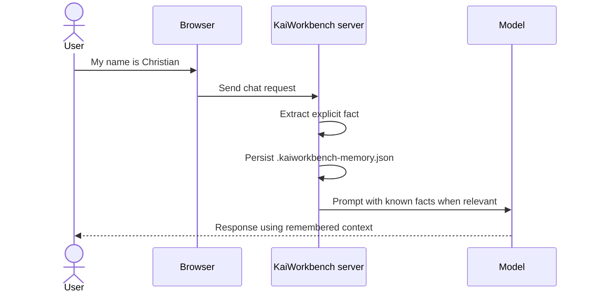

# LinkedIn Post Draft: KaiWorkbench

> Status: Early draft. Add a screenshot and repository link before publishing.

I have been building KaiWorkbench: a local, browser-based coding workspace for
OpenAI-compatible language models.

The goal is straightforward: keep the model, code, shell, and approval flow in
one local interface without giving the browser unrestricted access to the
machine.

The current workspace includes:

- streamed chat with Ollama, SGLang, or vLLM;
- a bounded coding-agent tool loop;
- explicit approval for shell commands and file writes;
- diff previews before agent-proposed changes are applied;
- an Ace editor with Vim bindings and syntax highlighting;
- a filesystem browser, Chat Box, and Bash REPL with a shared working directory;
- explicit fact memory for details like the user's name, preferences, and other
  user-provided facts;
- an editable stored-facts view from the chat footer;
- a repo-level `run_tests.ps1` that installs dependencies when needed, builds
  when a build script exists, and runs the full test suite;
- per-session model selection; and
- a persistent CppKAI runtime with Pi and Rho consoles plus executor-attached
  Debug and Tree panels.

The CppKAI integration does not assume one Executor. Debug and Tree each expose
their own live-Executor selector. Tree renders the selected Executor's object
hierarchy, while Debug directs step, continue, stack, and clear operations to
the selected handle. Runtime diagnostics go through KAI's logging system.

One implementation detail that matters is the filesystem boundary. File APIs
resolve paths against a configured `SAFE_ROOT`, canonicalize existing ancestors,
and reject traversal through symlinks. Shell access is called out separately: it
runs with the server user's permissions, so approval and OS-level isolation still
matter.

I have also brought the project documentation up to date with Mermaid diagrams
covering the architecture, fact memory, agent approval sequence, and
path-validation flow. The complete local server API is documented in
`API.md`, so the post and README do not need to duplicate endpoint details.

The current test path is intentionally boring: `./run_tests.ps1` is the single
entry point for local verification, including dependency refresh, optional
build, and the Node test suite.

Next: [briefly describe the next technical milestone].

Repository: [add link]

Screenshot/demo: [add media]

#LocalAI #LLM #SoftwareEngineering #DeveloperTools #OpenSource
