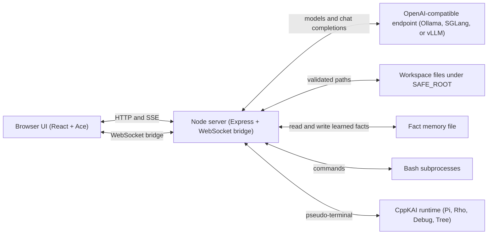
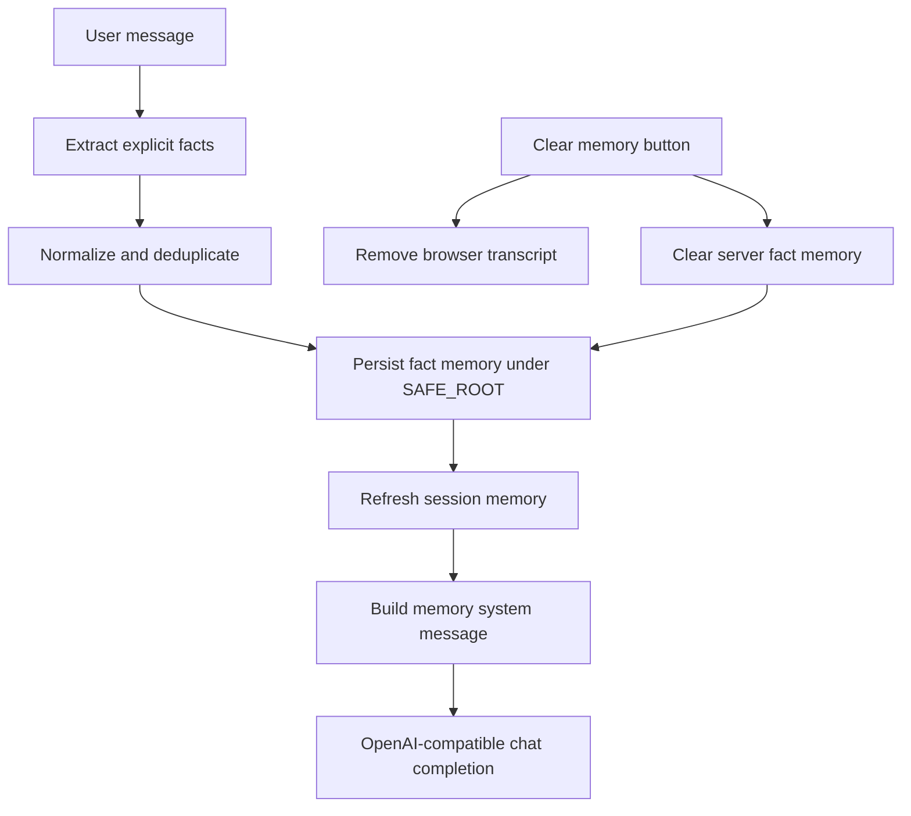
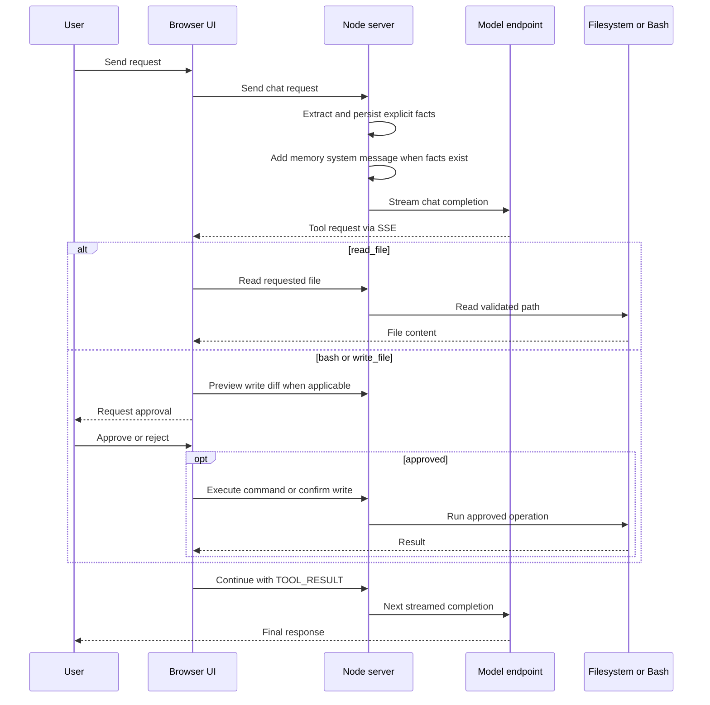
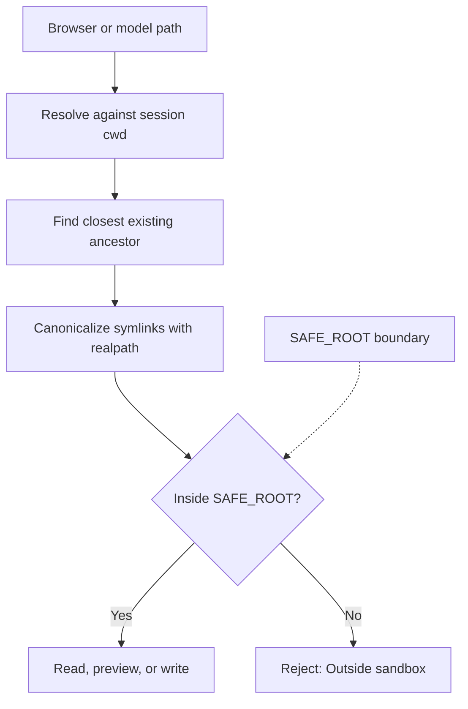

# KaiWorkbench Code Console

KaiWorkbench is a local, browser-based coding workspace for OpenAI-compatible
inference servers. It combines streamed chat, an approval-gated agent tool loop,
a filesystem browser, an Ace editor, a Bash REPL, and optional CppKAI language
consoles in one page.

## Architecture



The browser has no direct filesystem access. `server.js` validates file paths,
tracks each browser session's working directory and selected model, extracts
explicit user facts into persisted memory, proxies model traffic, and starts
local subprocesses. `index.html` contains the client UI. The complete HTTP,
SSE, NDJSON, WebSocket, static route, and upstream model API reference is
maintained in [API.md](API.md).

## Requirements

- Node.js 18 or newer
- An OpenAI-compatible model endpoint that implements `/v1/models` and
  `/v1/chat/completions`
- Bash for the shell and agent command tools
- Optional: CppKAI built at `Ext/CppKAI/Bin/Console` for the Pi, Rho, Debug,
  and Tree tabs
- Optional: Microsoft Edge and `msedgedriver` for the browser end-to-end test

The default endpoint is Ollama at `http://localhost:11434`, using the
`qwen2.5-coder:7b` coding model. The launcher uses a 2048-token context and
memory-conservative Ollama defaults so it can run on an 8 GB GPU with CPU
offload when needed. If Ollama is already running before `./s` starts, restart
Ollama so those memory settings take effect.

## Install

```bash
git clone --recurse-submodules <repository-url>
cd KaiWorkbench
npm install
```

For an existing clone, initialize the optional integrations with:

```bash
git submodule update --init --recursive
```

## Run

The launcher creates the configured model-cache directories, starts a local
Ollama server when necessary, checks that the selected Ollama model is installed,
stops an existing `node server.js` process, and then runs the application. It
opens the UI in a standalone browser window when the server becomes ready and
uses this repository as the default workspace, allowing KaiWorkbench to inspect and
modify its own implementation:

```bash
./s
```

Set `KAI_WORKBENCH_NO_WINDOW=1` to disable automatic window creation, or set
`KAI_WORKBENCH_BROWSER` to a browser executable that supports `--app`. The page may
also be opened directly from `index.html`; the server must still be running and
the default CORS policy must allow the resulting `null` origin.

To run without the launcher:

```bash
npm start
```

To use another inference server or workspace root:

```bash
KAI_WORKBENCH_BASE_URL=http://127.0.0.1:30000 \
KAI_WORKBENCH_MODEL=qwen2.5-coder:7b \
SAFE_ROOT=/home/user/projects \
npm start
```

For example, an SGLang endpoint can be started separately with:

```bash
python -m sglang.launch_server \
  --model-path qwen2.5-coder:7b \
  --port 30000
```

## Workspace

The UI has three persistent columns:

- **File browser:** browses from the current session directory, hides dotfiles by
  default, opens files in the editor, and can inject up to 8 KB into chat.
- **Chat and editor:** streams model responses, runs the bounded agent loop, and
  remembers up to 100 messages in browser-local storage, tracks explicit user
  facts in server-side memory, and edits files with Ace, Monokai, Vim bindings,
  syntax modes, and `Ctrl-S` or `Command-S` save.
- **Tools:** provides Bash plus a persistent CppKAI runtime with Pi, Rho,
  executor-attached Debug, and executor-attached Tree views.

Each browser session has its own current directory and selected model. A
successful `cd` in Bash or through the Chat Box updates the shared directory
used by Chat tools, Bash, and the file browser for that session. A `cd ...`
entered directly in Chat is routed through the normal command-approval flow
without asking the model to interpret it. Browser conversation memory survives
page reloads, server-side fact memory survives server restarts, and both can be
cleared from the chat input. Server-side working directory and model sessions
expire after 24 hours when capacity cleanup runs and are lost when the server
restarts.

## Memory

KaiWorkbench keeps two different forms of memory:

- **Conversation memory:** the browser stores up to 100 stable chat messages in
  `localStorage` so a page reload does not erase the visible transcript.
- **Fact memory:** the server extracts explicit personal facts from user
  messages, stores them in `.kaiworkbench-memory.json` under `SAFE_ROOT`, and injects
  them into future model requests as a separate system message.

Fact extraction is intentionally conservative. It captures forms such as
`my name is ...`, `call me ...`, `my <thing> is ...`, `I am based in ...`, and
`remember that ...`. It does not summarize arbitrary conversation turns. The
chat footer shows the current fact count, and **Clear memory** clears both the
browser transcript and the persisted fact file.



Only explicit user-provided facts are stored. The memory file is ignored by Git
to avoid accidentally committing personal data. Set `KAI_WORKBENCH_MEMORY_FILE` to
move the persisted fact store elsewhere.

## KAI Source RAG

KaiWorkbench can ground C++ questions in an indexed local KAI corpus before the
chat request is sent to the model. The chat footer has a `RAG` selector:

- `auto`: retrieve only for likely C++/KAI questions.
- `on`: always retrieve.
- `off`: preserve the original non-RAG chat path.

The v1 corpus is intentionally tight: `CppKaiCore` and `CppKaiLanguage` under
the configured KAI checkout. By default that checkout is `Ext/CppKAI`; set
`KAI_DIR` when the initialized KAI repository is elsewhere on disk:

```bash
git -C Ext/CppKAI submodule update --init Ext/CppKaiCore Ext/CppKaiLanguage
ollama pull nomic-embed-text
npm run rag:index
```

For an existing sibling checkout, use:

```bash
KAI_DIR=/home/christian/local/repos/CppKAI npm run rag:index
```

The indexer reads C/C++ source files, chunks declarations and definitions by
syntax-ish boundaries instead of fixed line counts, and carries leading doc
comments into the chunk. This keeps patterns such as:

```cpp
/// CRTP base used by tests.
template <class Derived>
class Base {
public:
  void call() { static_cast<Derived *>(this)->impl(); }
};
```

as one retrievable unit rather than splitting the template line from the class
body. Oversized declarations are split only after the normal declaration pass.

Embeddings are generated locally through Ollama with
`KAI_WORKBENCH_RAG_EMBED_MODEL` (default `nomic-embed-text`). Indexing is the
only time the embedding model must process the whole corpus. At query time,
KaiWorkbench embeds the user query first, then sends the grounded chat request;
with the launcher default `OLLAMA_MAX_LOADED_MODELS=1`, Ollama can sequence the
embedding model and the coding model instead of keeping both resident in 8 GB
VRAM.

The vector store is `.kaiworkbench-rag-index.json`: a flat JSON file containing
file hashes, chunk metadata, and embedding vectors. A flat file is deliberate
for a single-user desktop tool because it avoids native sqlite extension
installation and any separate vector database service. Re-running
`npm run rag:index` reuses unchanged files when the file hash and embedding
model match, so a KAI `git pull` only re-embeds changed files.

To add another corpus later, create a JSON config and point
`KAI_WORKBENCH_RAG_CORPORA` at it:

```json
{
  "corpora": [
    {"id": "CppKaiCore", "path": "Ext/CppKAI/Ext/CppKaiCore"},
    {"id": "CppKaiLanguage", "path": "Ext/CppKAI/Ext/CppKaiLanguage"},
    {"id": "CppReferenceTemplates", "path": "Corpus/cppreference/templates"}
  ]
}
```

`GET /api/rag/status` reports both index metadata and `corpusStatus`. If
`CppKaiCore` or `CppKaiLanguage` shows `files: 0`, initialize the nested KAI
submodules before indexing:

```bash
git -C Ext/CppKAI submodule update --init Ext/CppKaiCore Ext/CppKaiLanguage
npm run rag:index
```

### CRTP Regression Check

After the KAI submodules are initialized and indexed, ask:

```text
Explain CRTP in this KAI codebase. Use the indexed source.
```

The expected retrieved material should include a real self-type template from
the indexed KAI corpus, not an unrelated virtual-dispatch explanation. In this
checkout, `Ext/CppKAI/Ext/CppKaiCore` and `Ext/CppKAI/Ext/CppKaiLanguage` are
nested submodules; if `GET /api/rag/status` reports `files: 0` for them, run
the submodule update command above before using this as a real-code regression.
On this machine's populated sibling checkout, the relevant retrieval is:

```cpp
// Ext/CppKaiCore/Include/KAI/Core/BuiltinTypes/Container.h:9-32
template <class T>
struct Container : Reflected {
    bool Attach(Object const &Q) {
        if (!Self) {
            KAI_THROW_0(NullObject);
        }
        // ...
        Q.AddedToContainer(*Self);
        return true;
    }
};

// Ext/CppKaiCore/Include/KAI/Core/BuiltinTypes/Array.h:8-54
class Array : public Container<Array> {
   public:
    typedef std::vector<Object> Objects;
    typedef Objects::const_iterator const_iterator;
    typedef Objects::iterator iterator;
};
```

A passing grounded answer should look like:

```text
The retrieved KAI references show the CRTP/self-type shape in
`Container.h:9-32` and `Array.h:8-54`: `Container` is a template
(`template <class T> struct Container`) and the concrete type passes itself as
the template argument (`class Array : public Container<Array>`).

That is static polymorphism/self-type reuse: the derived type is named in the
base-class template argument. These references do not show ordinary runtime
virtual-function polymorphism for this pattern, so an answer should not pivot
to vtables or virtual dispatch unless another retrieved chunk supports that.
```

The unit test `RAG indexing is incremental and keeps CRTP chunks retrievable`
uses this same pattern as a local regression fixture. With the real KAI
submodules populated, the retrieved paths should come from
`Ext/CppKAI/Ext/CppKaiCore` or `Ext/CppKAI/Ext/CppKaiLanguage`.

## Agent Tool Flow

The model can request `read_file`, `write_file`, or `bash`. Reads execute
immediately. Commands and writes pause for explicit approval; proposed writes
show a unified diff before anything is changed. The client stops a run after
eight tool steps.

Stable general-knowledge questions are answered directly when the model is
confident. Network-capable tools remain available for explicit lookups,
time-sensitive information, and verification. The current `[cwd: ...]` marker
is authoritative model context; shell-shaped requests such as `cd`, `pwd`, and
`ls` are expected to use the Bash tool.



## Filesystem Boundary



Agent file reads are limited to 4 MB, browser file reads to 2 MB, and JSON
request bodies to 16 MB. New paths are checked through their closest existing
ancestor so a symlink cannot be used to escape `SAFE_ROOT`.

`SAFE_ROOT` constrains the file APIs only. Bash commands run as the server's OS
user and are not sandboxed, even when launched through the approval flow.

## Configuration

Browser-only settings live in `ui-config.json`. Set
`requestProgressDelaySeconds` to the number of seconds a chat request may run
before its spinner, progress bar, and elapsed timer appear.

| Variable | Default | Purpose |
|---|---|---|
| `KAI_WORKBENCH_BASE_URL` | `http://localhost:11434` | OpenAI-compatible endpoint base URL |
| `KAI_WORKBENCH_MODEL` | `qwen2.5-coder:7b` | Initial model for new sessions |
| `KAI_WORKBENCH_TIMEOUT_MS` | `120000` | Chat request timeout; minimum 1000 ms |
| `KAI_WORKBENCH_FIRST_BYTE_TIMEOUT_MS` | `90000` | Time allowed for a model stream to begin; minimum 1000 ms |
| `KAI_WORKBENCH_MAX_TOKENS` | `4096` | Completion token limit; minimum 256 |
| `KAI_WORKBENCH_HISTORY_MESSAGES` | `40` | Recent chat messages forwarded; minimum 4 |
| `KAI_WORKBENCH_RAG_INDEX` | `.kaiworkbench-rag-index.json` under the KaiWorkbench repo | Local flat-file RAG vector index |
| `KAI_WORKBENCH_RAG_EMBED_MODEL` | `nomic-embed-text` | Ollama embedding model used for indexing and query embeddings |
| `KAI_WORKBENCH_RAG_TOP_K` | `3` | Retrieved chunks injected into grounded chat prompts; clamped to 1-8 |
| `KAI_WORKBENCH_RAG_CORPORA` | unset | Optional JSON corpus config with a `corpora` array |
| `SAFE_ROOT` | `$HOME` | Root allowed by browser and agent file APIs |
| `KAI_WORKBENCH_MEMORY_FILE` | `$SAFE_ROOT/.kaiworkbench-memory.json` | Persisted explicit fact memory |
| `PORT` | `3001` | HTTP port |
| `HOST` | `127.0.0.1` | HTTP bind address |
| `KAI_WORKBENCH_ALLOWED_ORIGINS` | local app URLs and `null` | Comma-separated CORS and WebSocket origins |
| `MODEL_CACHE_ROOT` | `~/.models` | Cache root created by `./s` |
| `OLLAMA_MODELS` | `~/.models/ollama` | Ollama cache exported by `./s` |
| `OLLAMA_CONTEXT_LENGTH` | `2048` | Context limit used by launcher-managed Ollama |
| `OLLAMA_KV_CACHE_TYPE` | `q8_0` | Lower-memory KV cache used by launcher-managed Ollama |
| `OLLAMA_GPU_OVERHEAD` | `1073741824` | VRAM reserved so Ollama can offload layers instead of overcommitting |
| `OLLAMA_MAX_LOADED_MODELS` | `1` | Prevent multiple models competing for VRAM |
| `OLLAMA_NUM_PARALLEL` | `1` | Prevent concurrent requests duplicating context memory |
| `HF_HOME` | `~/.models/hf` | Hugging Face cache exported by `./s` |
| `MS_DIR` | `~/local/repos/CppLmmModelStore` | CppLmmModelStore checkout reported by the UI |
| `DEEPSEEK_MODEL_HOME` | platform data directory | ModelStore directory listed by the UI |
| `KAI_DIR` | `Ext/CppKAI` | CppKAI checkout |
| `ENET_DIR` | `Ext/CppKAI/Ext/ENet` | ENet checkout used by CppKAI |
| `KAI_CONSOLE` | `Ext/CppKAI/Bin/Console` | CppKAI console executable |

The model selector lists models returned by the active endpoint. Selecting a
model changes only the current browser session; it does not install or load a
model on the inference server.

## API

See [API.md](API.md) for the complete KaiWorkbench API reference, including HTTP
endpoints, Server-Sent Events, model-install NDJSON, the CppKAI WebSocket
protocol, static routes, request/response shapes, status codes, limits, and the
upstream OpenAI-compatible model API contract.

## CppKAI Runtime Views

Pi, Rho, Debug, and Tree are views over one session-owned CppKAI runtime. The
runtime survives panel and websocket reconnections and expires with the browser
session. Pi prints the complete data stack after each command. Stack entries
are shown top-first, with `[0]` on the physical bottom line; floating-point
values use the normal neutral value color.

Debug and Tree never assume a single Executor. Each has an independent dropdown
populated from all live `Executor` objects in the runtime Registry:

- **Debug** targets `step`, `continue`, `stack`, and `clear` actions at the
  selected Executor handle.
- **Tree** renders the selected Executor's own `Tree*`, root, scope, and bounded
  child hierarchy.

The websocket accepts request-ID-correlated `inspect_tree` and validated
`debug_action` messages. Requests and newline-delimited JSON responses share a
dedicated duplex control file descriptor; stdout and stderr remain terminal
streams. KAI initializes its native `Logger`; snapshot lifecycle, debugger
attachments and actions, and failures are recorded through that logging system.

## Security

The server binds to loopback by default. Do not bind `HOST` to a network
interface without adding authentication, transport security, and OS-level
process isolation. In particular:

- Bash can access anything available to the server user; `SAFE_ROOT` does not
  restrict shell commands.
- Browser editor saves are direct writes and do not use the agent diff approval
  flow.
- Fact memory is persisted as plaintext JSON. Keep `SAFE_ROOT` or
  `KAI_WORKBENCH_MEMORY_FILE` on local storage you trust, and clear memory before
  sharing a workspace.
- CORS is an origin check, not authentication.
- The CppKAI WebSocket starts a local executable with the server user's
  permissions.

## Tests

```bash
npm test
```

The Node test suite covers API validation, path traversal and symlink defenses,
session isolation, working-directory propagation, model selection, fact-memory
extraction and clearing, write diffs, executor inspection/debug wiring, Tree
rendering, UI wiring, and editor configuration. The Edge end-to-end test runs only when
Edge and `msedgedriver` are available on `PATH`; set `EDGE_BIN` and
`MSEDGEDRIVER` to use explicit executable paths.

## Troubleshooting

- **No models found:** verify that `KAI_WORKBENCH_BASE_URL/v1/models` returns an
  OpenAI-compatible model list.
- **CUDA buffer allocation fails:** close other GPU-heavy applications, stop any
  already-running Ollama daemon, and restart with `./s` so the 2048-token
  context, quantized KV cache, single-model loading, and CPU offload settings
  apply. If `qwen2.5-coder:7b` still cannot allocate on an 8 GB card, choose a
  smaller installed model from the header.
- **Ollama model is not installed:** run `ollama pull <model>` before `./s`.
- **Port already in use:** stop the existing server or set another `PORT`.
- **Outside sandbox:** choose a path under `SAFE_ROOT`; symlink escapes are
  intentionally rejected.
- **Wrong remembered fact:** click **Clear memory** in the chat footer, or edit
  or remove `.kaiworkbench-memory.json` under `SAFE_ROOT` while the server is stopped.
- **CppKAI Console is not built:** initialize the submodules and build the
  executable configured by `KAI_CONSOLE`.
- **Origin not allowed:** add the exact browser origin to
  `KAI_WORKBENCH_ALLOWED_ORIGINS`.
