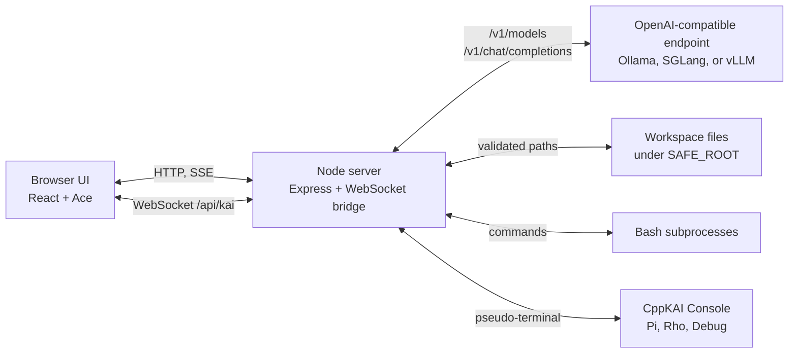
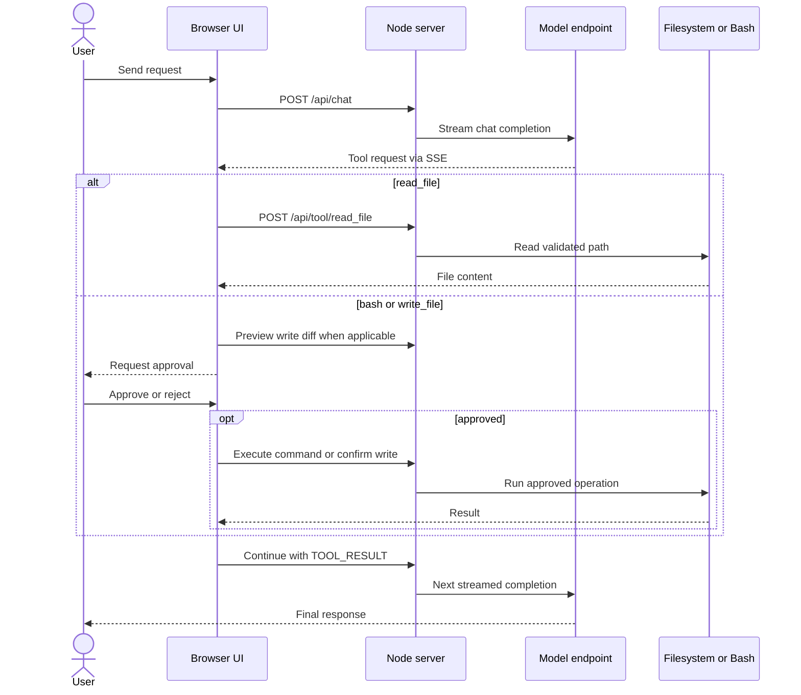
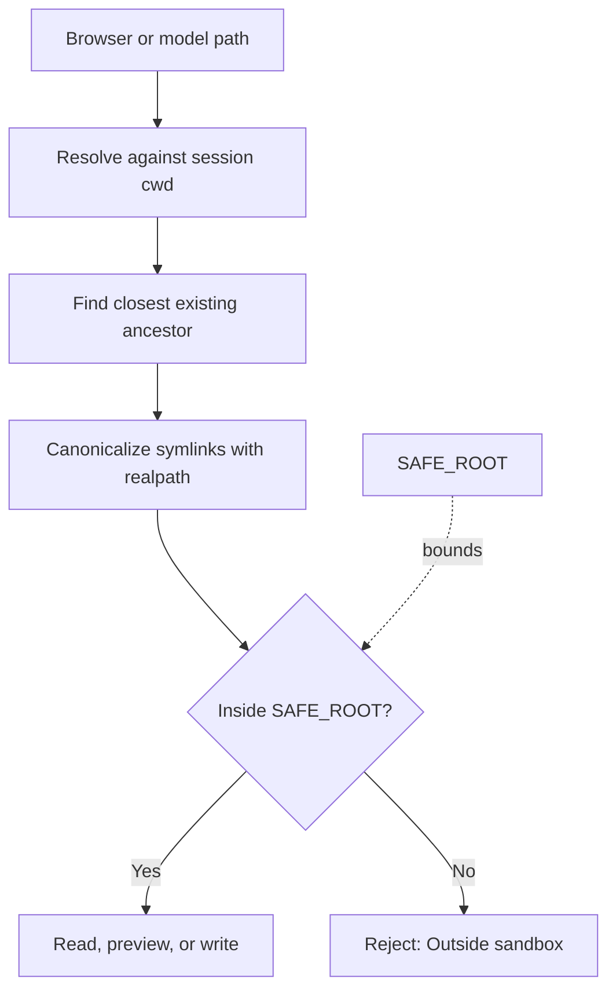

# NodeGLM-5 Code Console

NodeGLM-5 is a local, browser-based coding workspace for OpenAI-compatible
inference servers. It combines streamed chat, an approval-gated agent tool loop,
a filesystem browser, an Ace editor, a Bash REPL, and optional CppKAI language
consoles in one page.

## Architecture



The browser has no direct filesystem access. `server.js` validates file paths,
tracks each browser session's working directory and selected model, proxies model
traffic, and starts local subprocesses. `index.html` contains the client UI.

## Requirements

- Node.js 18 or newer
- An OpenAI-compatible model endpoint that implements `/v1/models` and
  `/v1/chat/completions`
- Bash for the shell and agent command tools
- Optional: CppKAI built at `Ext/CppKAI/Bin/Console` for the Pi, Rho, and Debug
  tabs
- Optional: Microsoft Edge and `msedgedriver` for the browser end-to-end test

The default endpoint is Ollama at `http://localhost:11434`, using `glm4:9b`.

## Install

```bash
git clone --recurse-submodules <repository-url>
cd NodeGLM-5
npm install
```

For an existing clone, initialize the optional integrations with:

```bash
git submodule update --init --recursive
```

## Run

The launcher creates the configured model-cache directories, starts a local
Ollama server when necessary, checks that the selected Ollama model is installed,
stops an existing `node server.js` process, and then runs the application:

```bash
./s
```

Open <http://localhost:3001/>. The page may also be opened directly from
`index.html`; the server must still be running and the default CORS policy must
allow the resulting `null` origin.

To run without the launcher:

```bash
npm start
```

To use another inference server or workspace root:

```bash
GLM_BASE_URL=http://127.0.0.1:30000 \
GLM_MODEL=GLM-5.2 \
SAFE_ROOT=/home/user/projects \
npm start
```

For example, an SGLang endpoint can be started separately with:

```bash
python -m sglang.launch_server \
  --model-path zai-org/GLM-5.2-FP8 \
  --port 30000
```

## Workspace

The UI has three persistent columns:

- **File browser:** browses from the current session directory, hides dotfiles by
  default, opens files in the editor, and can inject up to 8 KB into chat.
- **Chat and editor:** streams model responses, runs the bounded agent loop, and
  edits files with Ace, Monokai, Vim bindings, syntax modes, and `Ctrl-S` or
  `Command-S` save.
- **Tools:** provides the Bash REPL and optional Pi, Rho, and CppKAI debugger
  consoles.

Each browser session has its own current directory and selected model. A
successful `cd` through the agent Bash tool updates the shared directory used by
chat tools and the file browser for that session. Sessions are held in memory,
expire after 24 hours when capacity cleanup runs, and are lost when the server
restarts.

## Agent Tool Flow

The model can request `read_file`, `write_file`, or `bash`. Reads execute
immediately. Commands and writes pause for explicit approval; proposed writes
show a unified diff before anything is changed. The client stops a run after
eight tool steps.



## Filesystem Boundary



Agent file reads are limited to 4 MB, browser file reads to 2 MB, and JSON
request bodies to 16 MB. New paths are checked through their closest existing
ancestor so a symlink cannot be used to escape `SAFE_ROOT`.

`SAFE_ROOT` constrains the file APIs only. Bash commands run as the server's OS
user and are not sandboxed, even when launched through the approval flow.

## Configuration

| Variable | Default | Purpose |
|---|---|---|
| `GLM_BASE_URL` | `http://localhost:11434` | OpenAI-compatible endpoint base URL |
| `GLM_MODEL` | `glm4:9b` | Initial model for new sessions |
| `GLM_TIMEOUT_MS` | `120000` | Chat request timeout; minimum 1000 ms |
| `GLM_MAX_TOKENS` | `4096` | Completion token limit; minimum 256 |
| `GLM_HISTORY_MESSAGES` | `40` | Recent chat messages forwarded; minimum 4 |
| `SAFE_ROOT` | `$HOME` | Root allowed by browser and agent file APIs |
| `PORT` | `3001` | HTTP port |
| `HOST` | `127.0.0.1` | HTTP bind address |
| `GLM_ALLOWED_ORIGINS` | local app URLs and `null` | Comma-separated CORS and WebSocket origins |
| `MODEL_CACHE_ROOT` | `~/.models` | Cache root created by `./s` |
| `OLLAMA_MODELS` | `~/.models/ollama` | Ollama cache exported by `./s` |
| `HF_HOME` | `~/.models/hf` | Hugging Face cache exported by `./s` |
| `MS_DIR` | `~/local/repos/CppLmmModelStore` | CppLmmModelStore checkout reported by the UI |
| `DEEPSEEK_MODEL_HOME` | platform data directory | ModelStore directory listed by the UI |
| `KAI_DIR` | `Ext/CppKAI` | CppKAI checkout |
| `ENET_DIR` | `Ext/ENet` | ENet checkout linked into CppKAI when needed |
| `KAI_CONSOLE` | `Ext/CppKAI/Bin/Console` | CppKAI console executable |

The model selector lists models returned by the active endpoint. Selecting a
model changes only the current browser session; it does not install or load a
model on the inference server.

## HTTP API

| Method and path | Purpose |
|---|---|
| `POST /api/chat` | Proxy a streaming chat completion as server-sent events |
| `GET /api/models` | List models installed at the inference endpoint |
| `POST /api/session/model` | Select a model for one session |
| `GET /api/session` | Return the session directory, model, and root |
| `POST /api/tool/bash` | Run an approved agent command and update session cwd |
| `POST /api/tool/read_file` | Read an agent-requested file |
| `POST /api/tool/write_file/diff` | Preview an agent-requested write |
| `POST /api/tool/write_file/confirm` | Apply an approved agent write |
| `POST /api/repl/exec` | Execute a one-shot Bash REPL command |
| `GET /api/fs/list` | List a browser directory |
| `GET /api/fs/read` | Read a file for the browser editor |
| `POST /api/fs/write` | Save browser editor content |
| `GET /api/modelstore` | Report locally cached ModelStore entries |
| `GET /api/health` | Check the model endpoint and report active settings |
| `WS /api/kai` | Bridge the browser to a CppKAI console process |

Session identifiers may contain letters, digits, `.`, `_`, and `-`, with a
maximum length of 128 characters.

## Security

The server binds to loopback by default. Do not bind `HOST` to a network
interface without adding authentication, transport security, and OS-level
process isolation. In particular:

- Bash can access anything available to the server user; `SAFE_ROOT` does not
  restrict shell commands.
- Browser editor saves are direct writes and do not use the agent diff approval
  flow.
- CORS is an origin check, not authentication.
- The CppKAI WebSocket starts a local executable with the server user's
  permissions.

## Tests

```bash
npm test
```

The Node test suite covers API validation, path traversal and symlink defenses,
session isolation, working-directory propagation, model selection, write diffs,
UI wiring, and editor configuration. The Edge end-to-end test runs only when
Edge and `msedgedriver` are available on `PATH`; set `EDGE_BIN` and
`MSEDGEDRIVER` to use explicit executable paths.

## Troubleshooting

- **No models found:** verify that `GLM_BASE_URL/v1/models` returns an
  OpenAI-compatible model list.
- **Ollama model is not installed:** run `ollama pull <model>` before `./s`.
- **Port already in use:** stop the existing server or set another `PORT`.
- **Outside sandbox:** choose a path under `SAFE_ROOT`; symlink escapes are
  intentionally rejected.
- **CppKAI Console is not built:** initialize the submodules and build the
  executable configured by `KAI_CONSOLE`.
- **Origin not allowed:** add the exact browser origin to
  `GLM_ALLOWED_ORIGINS`.
